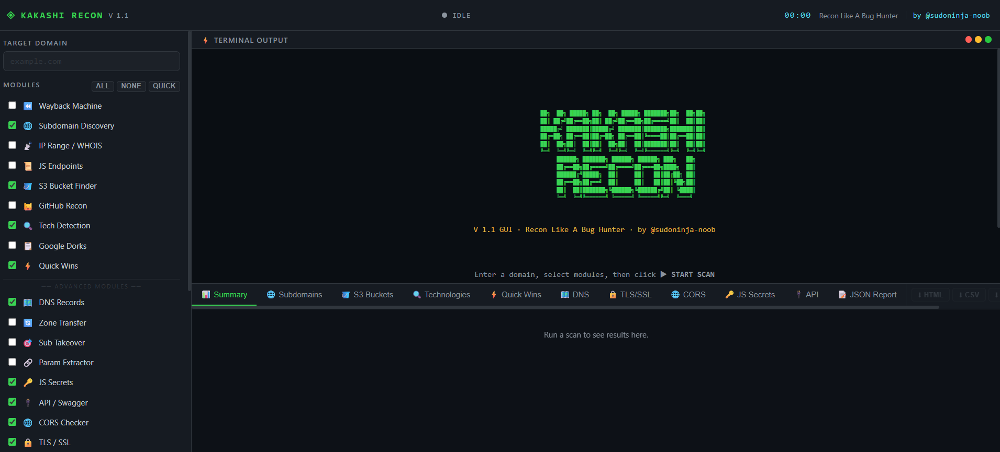

<div align="center">

```
 ██╗  ██╗ █████╗ ██╗  ██╗ █████╗ ███████╗██╗  ██╗██╗
 ██║ ██╔╝██╔══██╗██║ ██╔╝██╔══██╗██╔════╝██║  ██║██║
 █████╔╝ ███████║█████╔╝ ███████║███████╗███████║██║
 ██╔═██╗ ██╔══██║██╔═██╗ ██╔══██║╚════██║██╔══██║██║
 ██║  ██╗██║  ██║██║  ██╗██║  ██║███████║██║  ██║██║
 ╚═╝  ╚═╝╚═╝  ╚═╝╚═╝  ╚═╝╚═╝  ╚═╝╚══════╝╚═╝  ╚═╝╚═╝
      ██████╗ ███████╗ ██████╗ ██████╗ ███╗   ██╗
      ██╔══██╗██╔════╝██╔════╝██╔═══██╗████╗  ██║
      ██████╔╝█████╗  ██║     ██║   ██║██╔██╗ ██║
      ██╔══██╗██╔══╝  ██║     ██║   ██║██║╚██╗██║
      ██║  ██║███████╗╚██████╗╚██████╔╝██║ ╚████║
      ╚═╝  ╚═╝╚══════╝ ╚═════╝ ╚═════╝╚═╝  ╚═══╝
```

### **Recon Like A Bug Hunter**


**A modular, automated web reconnaissance tool with 20 recon modules and a native desktop GUI.**
*Built for bug hunters, penetration testers, and security researchers.*

[Features](#-features) · [Installation](#-installation) · [GUI Guide](#-gui-guide) · [CLI Usage](#-cli-usage) · [Modules](#-module-reference) · [Reports](#-report-export) · [Legal](#%EF%B8%8F-legal-disclaimer)

</div>

---

## 🧠 Overview

**KAKASHI RECON** is a fast, modular web reconnaissance framework that chains together **20 intelligence-gathering techniques** into a single workflow. It ships with both a **Python CLI** for scripting and automation, and a sleek **Electron desktop GUI** for visual, interactive recon sessions.

Designed for real-world bug bounty hunting — every module targets findings that matter: exposed secrets, subdomain takeovers, CORS misconfigs, dangling CNAMEs, TLS issues, leaked API keys, and more.

---

## ✨ Features

- 🔍 **20 Recon Modules** — from Wayback URLs to SSRF parameter hints
- 🖥️ **Native Desktop GUI** — built with Electron, dark hacker theme
- ⚡ **Live Terminal Output** — real-time streaming with ANSI color support
- 📊 **Auto Results Dashboard** — tabbed results panel renders after every scan
- ⬇️ **4 Export Formats** — download reports as HTML, CSV, PDF, or JSON
- 🔑 **JS Secrets Scanner** — 14 regex patterns (AWS keys, JWTs, GitHub tokens, Stripe, etc.)
- 🌐 **CORS Tester** — wildcard, reflected-origin, and credentials bypass detection
- 🔒 **TLS/SSL Inspector** — cert expiry, TLS version, cipher suite, SAN enumeration
- 🎯 **Subdomain Takeover** — 18 dangling CNAME service fingerprints
- 📡 **DNS Records Mapper** — A/AAAA/MX/TXT/NS/CNAME/SOA via DNS-over-HTTPS
- 🔌 **API Discovery** — GraphQL introspection, Swagger/OpenAPI, REST endpoint detection
- 🍪 **Cookie Security** — Secure / HttpOnly / SameSite flag auditing
- ↩️ **Open Redirect & SSRF** — parameter-based vulnerability hints from harvested URLs

---

## 📦 Installation

### Prerequisites

| Requirement | Version | Download |
|-------------|---------|----------|
| Python | 3.7+ | [python.org](https://www.python.org/downloads/) |
| Node.js | 18+ | [nodejs.org](https://nodejs.org/) |
| npm | 8+ | *(bundled with Node.js)* |
| Git | any | [git-scm.com](https://git-scm.com/) |

---

### Step 1 — Clone the Repository

```bash
git clone https://github.com/sudoninja-noob/kakashi-recon.git
cd kakashi-recon
```

> Don't have Git? Download the ZIP from the [Releases](../../releases) page and extract it.

---

### Step 2 — Install Python Dependencies

```bash
pip install -r requirements.txt
```

| Package | Purpose |
|---------|---------|
| `requests` | HTTP requests for all web modules |
| `beautifulsoup4` | HTML parsing for JS file crawling |
| `colorama` | Cross-platform ANSI terminal colors |
| `urllib3` | SSL warning suppression |

> 💡 **Using a virtual environment (recommended):**
> ```bash
> python -m venv venv
>
> # Activate — Windows:
> venv\Scripts\activate
>
> # Activate — Linux / macOS:
> source venv/bin/activate
>
> pip install -r requirements.txt
> ```

---

### Step 3 — Install GUI Dependencies

```bash
npm install
```

Downloads Electron and all required Node.js packages into `node_modules/`.

---
## 📸 Screenshot



### Step 4 — Launch the GUI

```bash
npm start
```

The **KAKASHI RECON** desktop window opens immediately. 🟢

---

## 🖥️ GUI Guide

The GUI is the recommended way to use KAKASHI RECON. It provides a fully interactive interface with real-time output, auto-rendered result tabs, and one-click report export.

### Interface Layout

```
┌──────────────────────────────────────────────────────────────────────────┐
│  ◈ KAKASHI RECON  V 1.1    ●  IDLE    00:00   Recon Like A Bug Hunter   │
│                                                         by @sudoninja-noob│
├──────────────┬───────────────────────────────────────────────────────────┤
│              │  ⚡ TERMINAL OUTPUT                          ● ● ●        │
│  TARGET      │                                                            │
│  ──────────  │  [*] Starting scan on example.com ...                     │
│  MODULES     │  [+] Found subdomain: api.example.com → 1.2.3.4          │
│  ──────────  │  [⚠] .env file accessible! → https://example.com/.env    │
│  OUTPUT DIR  │  [+] TLS cert expires in 87 days (TLSv1.3)               │
│  ──────────  │                                                            │
│  ▶ START     ├───────────────────────────────────────────────────────────┤
│  ■ STOP      │ 📊Summary│🌐Subs│🪣S3│🔍Tech│⚡Wins│🗺️DNS│🔒TLS│...  ⬇ │
│              │                                                            │
│  STATS       │  Auto-rendered results appear here after scan completes   │
└──────────────┴───────────────────────────────────────────────────────────┘
```

---

### Running a Scan

| Step | Action |
|------|--------|
| **1** | Enter the target domain in `TARGET DOMAIN` (e.g. `hackerone.com`) |
| **2** | Select modules using checkboxes — or use a quick button |
| **3** | Set output folder (default: `recon_output`) |
| **4** | Click **▶ START SCAN** or press `Enter` |

**Quick Module Buttons:**

| Button | Effect |
|--------|--------|
| `ALL` | Select all 20 modules |
| `NONE` | Deselect everything |
| `QUICK` | Fast preset — Subdomains + Tech + Quick Wins + DNS + TLS + CORS + API |

---

### Status Indicators

| Status | Colour | Meaning |
|--------|--------|---------|
| `IDLE` | ⚫ Grey | Ready — waiting for input |
| `SCANNING` | 🟢 Green (pulsing) | Scan actively running |
| `COMPLETE` | 🔵 Blue | Scan finished, results loaded |
| `STOPPED` | 🟡 Yellow | Manually cancelled by user |
| `ERROR` | 🔴 Red | Script error or Python not found |

---

### Results Tabs

Results are automatically parsed and rendered into tabs when a scan finishes:

| Tab | Contents |
|-----|---------|
| 📊 **Summary** | Stat cards + technology stack + critical findings banner |
| 🌐 **Subdomains** | Live subdomains table with resolved IPs |
| 🪣 **S3 Buckets** | Found buckets with PUBLIC / private status |
| 🔍 **Technologies** | Detected CMS, CDN, JS frameworks, web server |
| ⚡ **Quick Wins** | Accessible sensitive paths — flagged critical / non-critical |
| 🗺️ **DNS** | Full DNS record set (A / AAAA / MX / TXT / NS / CNAME / SOA) |
| 🔒 **TLS/SSL** | Certificate details, expiry countdown, cipher, SANs |
| 🌐 **CORS** | CORS misconfiguration findings with severity |
| 🔑 **JS Secrets** | Leaked keys and tokens found in JavaScript files |
| 🔌 **API** | Discovered API, GraphQL, and Swagger/OpenAPI endpoints |
| 📝 **JSON Report** | Raw JSON viewer — scroll and inspect all data |

---

## ⬇️ Report Export

After every scan, **four download buttons** appear in the tabs bar. Buttons are greyed out until a scan completes.

| Button | Format | Description |
|--------|--------|-------------|
| `⬇ HTML` | `.html` | Styled dark-theme report — open in any browser, shareable |
| `⬇ CSV` | `.csv` | Multi-section spreadsheet — opens in Excel or Google Sheets |
| `⬇ PDF` | `.pdf` | Print-ready PDF generated via Electron's PDF engine |
| `⬇ JSON` | `.json` | Raw structured data — use for scripting or further processing |

> Reports are auto-named: `example.com_recon_report.pdf`
>
> A **toast notification** confirms every successful save in the bottom-right corner.

---

## 💻 CLI Usage

KAKASHI RECON also runs fully from the terminal — useful for automation, CI pipelines, or headless environments.

### Syntax

```bash
python kakashi_recon.py <domain> [options]
```

### Options

| Flag | Long Form | Description | Default |
|------|-----------|-------------|---------|
| *(first arg)* | — | Target domain (required) | — |
| `-m` | `--modules` | Comma-separated module list | `all` |
| `-o` | `--output` | Output directory path | `recon_output` |

### Examples

```bash
# Full scan — all 20 modules
python kakashi_recon.py example.com

# QUICK preset — fast, high-value modules
python kakashi_recon.py example.com -m subdomains,tech,quick,dns,tls,cors,api

# Bug bounty workflow — no GitHub dorks
python kakashi_recon.py example.com -m wayback,subdomains,js,s3,secrets,api,cors,tls,cookies

# Save results to a custom directory
python kakashi_recon.py example.com -m all -o ~/results/example_scan

# Single module — TLS inspection only
python kakashi_recon.py example.com -m tls

# OSINT focus
python kakashi_recon.py example.com -m wayback,subdomains,ip,github,content

# Security deep-dive
python kakashi_recon.py example.com -m secrets,cors,tls,cookies,methods,redirect,api
```

---

## 📋 Module Reference

### All 20 Modules

| # | Flag | Module | What It Does |
|---|------|--------|-------------|
| 1 | `wayback` | **Wayback Machine** | Pulls archived URLs & old `robots.txt` via Wayback CDX API |
| 2 | `subdomains` | **Subdomain Discovery** | Enumerates subdomains via crt.sh, HackerTarget, AlienVault OTX + DNS validation |
| 3 | `ip` | **IP Range / WHOIS** | Resolves IP, queries ARIN RDAP for ASN / network range |
| 4 | `js` | **JS Endpoint Extraction** | Crawls JS files, regex-extracts API paths and hidden endpoints |
| 5 | `s3` | **S3 Bucket Finder** | Tests 33 naming variations for public/existing AWS S3 buckets |
| 6 | `github` | **GitHub Recon** | Generates GitHub code search dorks for leaked secrets & credentials |
| 7 | `tech` | **Technology Detection** | Fingerprints CMS, CDN, JS framework, web server via headers & HTML |
| 8 | `content` | **Google Dorks** | Generates Google dork queries (SQLi params, admin panels, backup files) |
| 9 | `quick` | **Quick Wins** | HTTP-checks 36 sensitive paths (`.git`, `.env`, `phpinfo.php`, backups…) |
| 10 | `dns` | **DNS Records Mapper** | Maps A/AAAA/MX/TXT/NS/CNAME/SOA via Cloudflare DNS-over-HTTPS |
| 11 | `zone` | **Zone Transfer Check** | Tests AXFR zone transfer against all discovered nameservers |
| 12 | `takeover` | **Subdomain Takeover** | Detects dangling CNAMEs using 18 known service fingerprints |
| 13 | `params` | **Parameter Extractor** | Harvests URL parameters from Wayback + flags SQLi/SSRF/redirect risks |
| 14 | `secrets` | **JS Secrets Scanner** | Scans JS files with 14 regex patterns: AWS keys, JWTs, GitHub tokens, Stripe, etc. |
| 15 | `api` | **API & Swagger Finder** | Discovers REST/GraphQL introspection endpoints and Swagger/OpenAPI docs |
| 16 | `cors` | **CORS Tester** | Tests wildcard ACAO, reflected-origin, and `credentials: true` misconfigurations |
| 17 | `tls` | **TLS/SSL Inspector** | Checks cert expiry, TLS version, cipher suite, HSTS header, and SANs |
| 18 | `cookies` | **Cookie Security** | Audits session cookies for missing `Secure`, `HttpOnly`, and `SameSite` flags |
| 19 | `methods` | **HTTP Method Analyzer** | Enumerates PUT, DELETE, TRACE, OPTIONS — flags XST (Cross-Site Tracing) |
| 20 | `redirect` | **Open Redirect & SSRF** | Flags risky URL parameters from harvested URLs as redirect/SSRF candidates |

---

## 📂 Output Files

All output is saved to `recon_output/` (or your custom `-o` path):

```
recon_output/
├── example.com_report.json           ← Full structured JSON (auto-generated)
├── example.com_subdomains.txt        ← Live subdomains list, one per line
├── example.com_wayback_urls.txt      ← All Wayback Machine archived URLs
├── example.com_wayback_juicy.txt     ← Filtered juicy URLs (.sql, .bak, .config…)
├── example.com_js_endpoints.txt      ← Extracted JS API paths and endpoints
└── example.com_google_dorks.txt      ← Generated Google dork query list
```

### JSON Report Structure

```json
{
  "target":        "example.com",
  "scan_time":     "2026-03-04T12:00:00",
  "subdomains":    [{ "host": "api.example.com", "ip": "1.2.3.4" }],
  "s3_buckets":    [{ "bucket": "example-backup", "url": "...", "status": "🔒 EXISTS (403)" }],
  "technologies":  { "Web Server": "nginx", "CDN": "Cloudflare", "CMS": "WordPress" },
  "quick_wins":    [{ "url": "...", "label": ".env file", "status": 200, "critical": true }],
  "dns_records":   { "A": ["1.2.3.4"], "MX": ["mail.example.com"], "TXT": ["v=spf1 ..."] },
  "tls":           { "cn": "example.com", "days_left": 87, "tls_version": "TLSv1.3", "cipher": "..." },
  "cors":          [{ "severity": "high", "origin": "evil.com", "acao": "evil.com", "credentials": "true" }],
  "js_secrets":    [{ "type": "AWS_ACCESS_KEY", "match": "AKIA...", "file": "https://.../app.js" }],
  "api_endpoints": [{ "type": "swagger/openapi", "url": "https://example.com/api/docs", "size": 4521 }],
  "wayback_urls":  ["https://example.com/admin?debug=1", "..."],
  "js_endpoints":  ["/api/v1/users", "/internal/config", "..."],
  "parameters":    [{ "param": "redirect", "url": "...", "risk": "open-redirect" }],
  "http_methods":  { "allowed": ["GET", "POST", "OPTIONS"], "dangerous": ["TRACE"] },
  "cookies":       [{ "name": "session", "secure": false, "httponly": true, "samesite": "None" }]
}
```

---

## 🎨 Terminal Color Legend

| Symbol | Color | Meaning |
|--------|-------|---------|
| `[*]` | 🔵 Blue | Info / status message |
| `[+]` | 🟢 Green | Successful find |
| `[!]` | 🟡 Yellow | Warning / notable result |
| `[-]` | 🔴 Red | Error or failure |
| `[⚠]` | 🔴 Red Bold | **Critical finding — investigate immediately** |

---

## 🛠️ Tech Stack

| Layer | Technology |
|-------|-----------|
| **Recon Engine** | Python 3.7+ |
| **HTTP Requests** | `requests` + `urllib3` |
| **HTML Parsing** | `beautifulsoup4` |
| **Terminal Colors** | `colorama` |
| **DNS Lookups** | Cloudflare DNS-over-HTTPS *(no extra deps)* |
| **Zone Transfer** | Raw TCP DNS AXFR via Python `socket` |
| **Desktop GUI** | Electron 28+ |
| **IPC Bridge** | Electron `contextBridge` / `ipcRenderer` |
| **PDF Export** | Electron `webContents.printToPDF()` |
| **Report Formats** | HTML · CSV · PDF · JSON |

---

## 🔧 Troubleshooting

<details>
<summary><b>❌ GUI shows ERROR status after clicking Start Scan</b></summary>

The GUI calls `python` to run `kakashi_recon.py`. Make sure Python is in your system `PATH`:

```bash
python --version    # Should print Python 3.x.x
```

If it's not found, either add Python to PATH or edit `main.js` to use the full Python path.
</details>

<details>
<summary><b>❌ `python` not found on Windows</b></summary>

```bash
# Try python3
python3 kakashi_recon.py example.com

# Or use the full path
C:\Python311\python.exe kakashi_recon.py example.com
```
</details>

<details>
<summary><b>❌ Module returns no results</b></summary>

Some modules depend on external APIs (crt.sh, HackerTarget, Wayback Machine):
- Check your internet connection
- The target may have little indexed data
- External APIs may be rate-limiting — wait and retry
</details>

<details>
<summary><b>❌ pip install fails</b></summary>

```bash
# Upgrade pip first
python -m pip install --upgrade pip
pip install -r requirements.txt
```
</details>

<details>
<summary><b>❌ npm install fails / Electron won't launch</b></summary>

```bash
# Clear npm cache and reinstall
npm cache clean --force
rm -rf node_modules
npm install
npm start
```
</details>

---

## 🔗 Recommended Companion Tools

KAKASHI RECON handles the automated recon layer. Pair it with these tools for deeper manual testing:

| Tool | Purpose |
|------|---------|
| [Amass](https://github.com/owasp-amass/amass) | In-depth attack surface mapping |
| [Nuclei](https://github.com/projectdiscovery/nuclei) | Template-based vulnerability scanning |
| [ffuf](https://github.com/ffuf/ffuf) | Fast web fuzzer for directories and files |
| [Gobuster](https://github.com/OJ/gobuster) | DNS / directory / vhost brute-force |
| [LinkFinder](https://github.com/GerbenJavado/LinkFinder) | Deep JS endpoint extraction |
| [TruffleHog](https://github.com/trufflesecurity/trufflehog) | Git history secret scanning |
| [Sublist3r](https://github.com/aboul3la/Sublist3r) | Extended passive subdomain enumeration |
| [Burp Suite](https://portswigger.net/burp) | Manual HTTP interception and testing |
| [Wappalyzer](https://www.wappalyzer.com/) | Browser-based technology fingerprinting |

---

## ⚠️ Legal Disclaimer

> **This tool is strictly for authorized security testing only.**
>
> - ✅ Use only against systems you **own** or have **explicit written permission** to test
> - ✅ Always follow your bug bounty program's **scope and rules of engagement**
> - ❌ Unauthorized scanning is **illegal** under the CFAA, UK Computer Misuse Act, and equivalent laws worldwide
> - ❌ The author assumes **no liability** for misuse, damage, or legal consequences

---

## 🤝 Contributing

Contributions, ideas, and bug reports are welcome!

1. Fork the repository
2. Create your feature branch: `git checkout -b feature/new-module`
3. Commit your changes: `git commit -m 'Add new module: XYZ'`
4. Push to the branch: `git push origin feature/new-module`
5. Open a Pull Request

---

## 📄 License

This project is licensed under the **MIT License**.

```
MIT License — free to use, modify, and distribute with attribution.
```

---

## 📊 Data Sources

| Source | Used For |
|--------|---------|
| [crt.sh](https://crt.sh) | Certificate transparency subdomain enumeration |
| [HackerTarget API](https://hackertarget.com) | Subdomain & host lookup |
| [AlienVault OTX](https://otx.alienvault.com) | Passive DNS subdomain data |
| [Wayback Machine CDX API](https://web.archive.org/cdx/) | Archived URL retrieval |
| [ARIN RDAP](https://rdap.arin.net) | IP range and WHOIS lookup |
| [Cloudflare DoH](https://cloudflare-dns.com/dns-query) | DNS record resolution |
| [AWS S3](https://aws.amazon.com/s3/) | Bucket enumeration |

---

<div align="center">

Made with 🖤 for the bug bounty community

**KAKASHI RECON V1.1**

Built by **[@sudoninja-noob](https://github.com/sudoninja-noob)** · *Recon Like A Bug Hunter*

⭐ Star this repo if it helped you find bugs!

</div>
